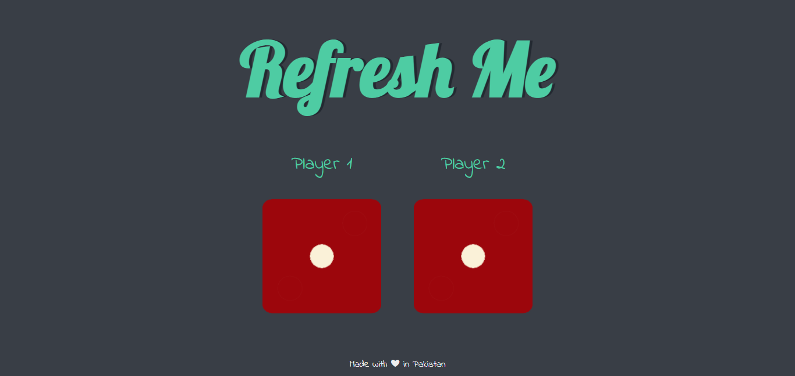

# Javascript Random Dice Application
Simple Javascript application, where two dice with the random values will be generated every time the user refreshes the application. The player with the higher value will be won.
Visit the application at: https://ali-thegilfoyle.github.io/javascript-random-dice-application/

